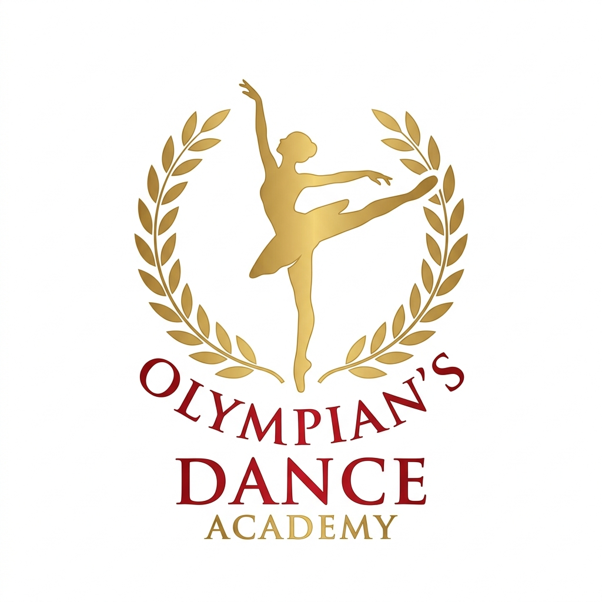
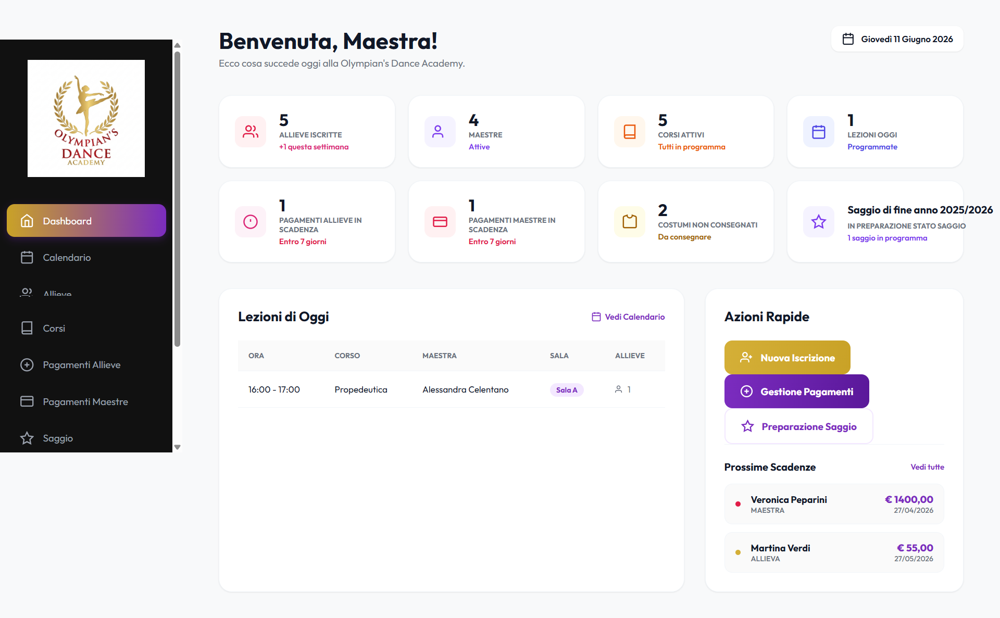

# Olympian's Dance Academy



Gestionale web Django per organizzare le attivita di una scuola di danza: anagrafiche, corsi, calendario lezioni, pagamenti, certificati, costumi e preparazione del saggio.

## Funzionalita principali

- **Dashboard iniziale** con riepilogo di allieve, maestre, corsi attivi, lezioni del giorno, pagamenti in scadenza, costumi da consegnare e stato del saggio.
- **Calendario lezioni** con giorni, orari, sale, corsi e maestre assegnate.
- **Gestione allieve** con dati anagrafici, contatti, corso frequentato, certificato medico e scheda di dettaglio.
- **Gestione maestre** con contatti, specializzazione e compenso mensile.
- **Gestione corsi** con livello, fascia di eta e maestra responsabile.
- **Pagamenti allieve e maestre** con importo, scadenza, stato e registrazione del pagamento.
- **Certificati medici** con elenco delle allieve con certificato mancante o in scadenza.
- **Saggio di fine anno** con saggi, coreografie, ordine di uscita, atti, musiche, durata, corsi e maestre collegate.
- **Costumi** con inventario, stato ordine, assegnazioni, consegna e pagamento.
- **Form di inserimento e modifica** per allieve, maestre, corsi, saggi e coreografie.

## Tecnologie utilizzate

- **Python** come linguaggio principale.
- **Django 5.0.6** per routing, template, ORM, configurazione e avvio dell'applicazione web.
- **SQLite** come database locale tramite il file `Scuola.db`.
- **HTML template Django** nella cartella `templates/`.
- **CSS personalizzato** in `static/css/style.css`.
- **File statici** nella cartella `static/`, con immagini in `static/images/`.

File principali:

- `manage.py`: comandi Django.
- `dance_academy/settings.py`: configurazione del progetto.
- `dance_academy/urls.py`: routing principale, inclusa l'area admin.
- `academy/urls.py`: pagine dell'applicazione.
- `academy/views.py`: viste Django e query tramite ORM.
- `academy/models.py`: modelli dati collegati alle tabelle SQLite.

## Installazione ed avvio

Requisiti consigliati:

- Python 3.10 o superiore.
- pip.

Da PowerShell, nella cartella del progetto:

```powershell
py -m venv .venv
.\.venv\Scripts\Activate.ps1
pip install -r requirements.txt
```

Il progetto include gia il database locale `Scuola.db`. Per controllare la configurazione Django:

```powershell
py manage.py check
```

Per avviare il server di sviluppo:

```powershell
py manage.py runserver
```

Aprire poi il browser su:

```text
http://127.0.0.1:8000/
```

Pagine utili:

- `http://127.0.0.1:8000/` - dashboard.
- `http://127.0.0.1:8000/admin/` - area admin Django.
- `http://127.0.0.1:8000/allieve/` - gestione allieve.
- `http://127.0.0.1:8000/corsi/` - gestione corsi.
- `http://127.0.0.1:8000/saggio/` - gestione saggio e coreografie.

Variabili opzionali:

```powershell
$env:DJANGO_SECRET_KEY = "sostituisci_con_una_chiave_sicura"
$env:DJANGO_DEBUG = "True"
```

Per eseguire i test:

```powershell
py manage.py test
```

## Interfaccia web

L'interfaccia usa una sidebar laterale con logo e navigazione verso tutte le aree principali:

- Dashboard
- Calendario
- Allieve
- Maestre
- Corsi
- Pagamenti Allieve
- Pagamenti Maestre
- Saggio
- Costumi
- Certificati

La dashboard mostra statistiche e scadenze operative, mentre le sezioni interne usano tabelle, badge di stato e pulsanti per le azioni principali.

Screenshot della dashboard:



## Licenza

Questo progetto e distribuito con licenza **MIT**. La licenza permette di usare, copiare, modificare e distribuire il software, mantenendo il riferimento al copyright originale. Il software viene fornito senza garanzie: per il testo completo consultare il file `LICENSE`.
